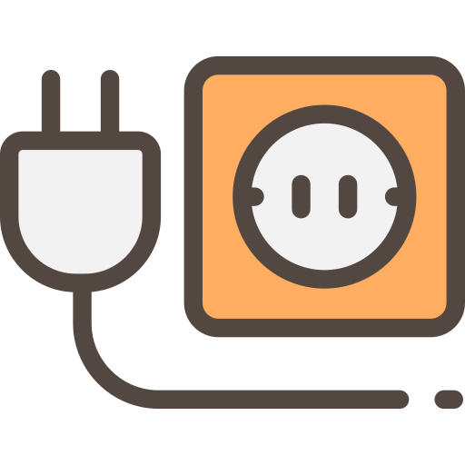
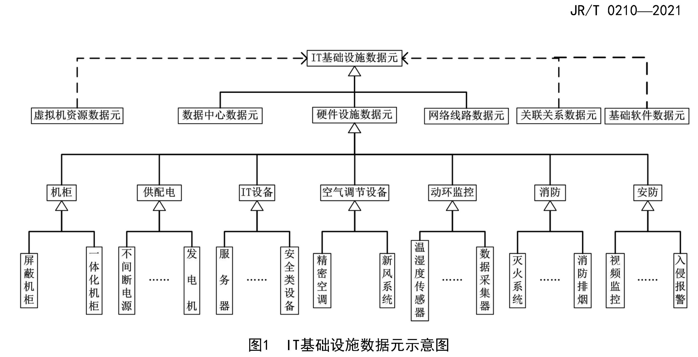

## 目录
- iTop 是什么，为什么要用 iTop
- iTop 怎么用
- iTop 定制开发
- 案例及插件介绍

# iTop 是什么

## iTop 是什么
<!--
{height=11%}
{height=11%}
{height=11%}
{height=11%}
{height=11%}
{height=11%}
{height=11%}
{height=11%}
{height=11%}
-->
- iTop 表示  **IT Operational Portal**
- iTop 是一个 ITSM 解决方案，提供一个灵活的 CMDB 管理配置项及其关系
- iTop 基于 ITIL^[ITIL 是 CCTA（英国国家电脑局）于 1980 年开发的一套 IT 服务管理（IT Service Management，ITSM）标准库。它把英国在 IT 管理方面的方法归纳起来，变成规范，为企业的 IT 部门提供一套从计划、研发、实施到运维的标准方法]，能够管理用户请求、事件、问题、变更和服务目录
- iTop 是使用 AGPLv3 协议的开源软件，可以从 Github 免费获取代码
- iTop 使用 PHP 语言和 MySQL 数据库
- iTop 支持插件机制，提供 API，可以方便的扩展功能，集成其他系统

<!--
- iTop Hub 提供插件下载（部分付费）以及完善的文档
-->

## iTop 能做什么

- 记录 IT 基础设施以及基础设施的各个部分之间的所有关联关系（服务器、应用程序、网络设备、虚拟机、联系人、位置 ...）
- 管理事件，用户请求，变更计划 ...
- 记录与外部供应商的 IT 服务和合同，包括服务等级协议（SLA）
- 以手动或脚本方式导出所有信息
- 批量导入（手动或使用脚本）或同步来自外部系统的任何数据

## iTop 界面

\begin{center}
\includegraphics[height=0.85\textheight]{images/itop-page.pdf}
\end{center}

## 为什么要用 iTop
\begin{center}
\includegraphics[height=0.85\textheight]{images/itop.pdf}
\end{center}

## iTop 功能特性 - 关联关系可视化分析
\begin{center}
\includegraphics[]{images/impacts.pdf}
\end{center}

## iTop 功能特性- 审计

\begin{center}
\includegraphics[]{images/audit.pdf}
\end{center}

## iTop 功能特性 - 仪表盘
\begin{center}
\includegraphics[]{images/dashboard.pdf}
\end{center}

## iTop 功能特性 - OQL 查询
\begin{center}
\includegraphics[]{images/oql.pdf}
\end{center}

## iTop 功能特性 - 批量导入导出

\begin{center}
\includegraphics[]{images/import.pdf}
\end{center}

# iTop 怎么用

## CMDB 功能

\begin{center}
\includegraphics[height=0.9\textheight]{images/cmdb.png}
\end{center}

## 服务管理
\begin{center}
\includegraphics[]{images/itsm.jpg}
\end{center}

# iTop 定制开发

## iTop 特点 - 面向对象的模型设计
\begin{center}
\includegraphics[]{images/inherit.pdf}
\end{center}

## iTop 特点 - 插件式开发

\begin{center}
\includegraphics[]{images/compare.pdf}
\end{center}

## iTop 架构

::::{.columns}
:::{.column}

:::
:::{.column}
橙色部分是可以自定义的部分

- 新增或修改数据模型
- 创建自定义角色
- 自定义门户或开发新的门户
- 通过插件扩展用户界面
:::
::::

## 模型编译

::::{.columns}
:::{.column width=44%}
{height=90%}
:::
:::{.column width=5%}
 
  
 

Setup
{width=90%}
Toolkit
:::
:::{.column width=42%}
{height=90%}
:::
::::

## 查看数据模型
\begin{center}
\includegraphics[height=0.85\textheight]{images/datamodel.pdf}
\end{center}

## 生命周期

```{#fig:userrequest2 .plot:dot height=85%}
digraph finite_state_machine {
	rankdir=LR;
	fontname="思源宋体";
	label="\n\n\nUserRequest 生命周期"
	node [style=filled fillcolor="#ffffff" fontname="思源宋体"];
	edge [fontname="思源宋体"];
	new -> assigned [ label="指派"];
	new -> escalated_tto [ label="超时"];
	new -> waiting_for_approval [ label="等待审批"];
	new -> resolved [ label="自动解决"];
	escalated_tto -> assigned [ label="指派"];
	assigned -> pending [ label="暂挂"];
	assigned -> resolved [ label="标记为解决"];
	assigned -> assigned [ label="重指派"];
	assigned -> escalated_ttr [ label="超时"];
	assigned -> resolved [ label="自动解决"];
	assigned -> rejected [ label="拒绝",color=red,style=bold,fontcolor=red];
	escalated_ttr -> pending [ label="暂挂"];
	escalated_ttr -> resolved [ label="标记为解决"];
	escalated_ttr -> assigned [ label="重指派"];
	escalated_ttr -> resolved [ label="自动解决"];
	waiting_for_approval -> approved [ label="审批"];
	waiting_for_approval -> rejected [ label="拒绝"];
	approved -> escalated_tto [ label="超时"];
	approved -> assigned [ label="指派"];
	approved -> resolved [ label="自动解决"];
	rejected -> new [ label="重新打开"];
	rejected -> closed [ label="关闭这个请求",color=red,style=bold,fontcolor=red];
	pending -> assigned [ label="指派"];
	pending -> resolved [ label="自动解决"];
	resolved -> closed [ label="关闭这个请求"];
	resolved -> assigned [ label="重新打开"];
	resolved -> resolved [ label="自动解决"];
	new [ shape=circle,label="新建"];
	escalated_tto [ shape=circle,label="升级 \n 响应 \n 时间"];
	assigned [ shape=circle,label="指派"];
	escalated_ttr [ shape=circle,label="升级 \n 解决 \n 时间"];
	waiting_for_approval [ shape=circle,label="待批"];
	approved [ shape=circle,label="批准"];
	rejected [ shape=circle,label="拒绝"];
	pending [ shape=circle,label="暂挂"];
	resolved [ shape=circle,label="已解决"];
	closed [ shape=doublecircle,label="关闭"];
}
```

## 开发辅助工具 - Toolkit
\begin{center}
\includegraphics[]{images/toolkit-page.pdf}
\end{center}

## 插件开发流程

```{.plot:dot}
digraph graphname {
    rankdir = LR;
	fontname="思源宋体"
	node[fontname="思源宋体"]
	edge[fontname="思源宋体"]
    start [shape="doublecircle",label="开始"]
    end [shape="doublecircle",label="完成"]
    
    empty [shape=record, label="创建 \n 空模块"]
    setup [shape=record, label="安装 \n 空模块", style=filled, fillcolor=cyan]
    develop [shape=record, label="开发"]
    toolkit [shape=diamond, label="toolkit\n 编译",style=filled, fillcolor=cyan]
    uat [shape=diamond, label="功能 \n 测试"]
    release [shape=record,label="发布"];
    
    start -> empty;
    empty -> setup -> develop;
    develop -> toolkit;
    toolkit -> develop [label="报错"];
    toolkit -> uat [label="正常"];
    uat -> develop [label="异常"];
    uat -> release [label="正常"];
    release -> end;
    label="\n\niTop 插件开发一般步骤";
}
```

## 集成其他系统
::::{.columns}
:::{.column}
REST/JSON services

- 列出支持的操作：list_operations
- 查：core/get
- 增：core/create
- 改：core/update
- 删：core/delete
- 查关联关系：core/get_related
- 生命周期操作：core/apply_stimulus
- 通过插件扩展的自定义操作 ...
:::
:::{.column}
```{.json}
{
   "operation": "core/get",
   "class": "Person",
   "key": "SELECT Person WHERE email LIKE '%.com'",
   "output_fields": "friendlyname, email"
}
```
:::
::::

```{#lst:curl .bash}
curl -X POST  -F 'version=1.3' -F 'auth_user=admin' -F 'auth_pwd=admin' http://itop-domain/webservices/rest.php -F 'json_data=@./json-operation.json'
```

# 案例及插件介绍

## URL 自助监控
\begin{center}
\includegraphics[height=0.9\textheight]{images/itop-url.png}
\end{center}

## 央行金融业数据上报

::::{.columns}
:::{.column}
```{.plot:dot}
digraph cmdb {
    rankdir=TB;
    node[shape=record];
    FunctionalCI->{BusinessProcess,PhysicalDevice,ApplicationSoluion};
    PhysicalDevice->{TelephonyCI,ConnectableCI,Rack};
    TelephonyCI->{Phone,MobilePhone};
    ConnectableCI->{PC,Printer,DatacenterDevice};
    DatacenterDevice->{Server,NetworkDevice};
}
```
:::
:::{.column}

:::
::::

## TeemIP - IPAM 解决方案

::::{.columns}
:::{.column width=43%}

:::
:::{.column width=50%}

:::
::::

## Kubernetes 管理系统
\begin{center}
\includegraphics[height=0.9\textheight]{images/itop-k8s.png}
\end{center}

## iTop 3.0 界面

\begin{center}
\includegraphics[height=0.85\textheight]{images/iTop3.pdf}
\end{center}

## 参考资料

本次分享结束，感谢您的聆听。通过以下链接可以获取 iTop 的更多信息。

- Combodo 主页：https://www.combodo.com/
- 源码：https://github.com/Combodo/iTop
- 下载：https://sourceforge.net/projects/itop/
- 文档：https://www.itophub.io/wiki/page
- iTopHub：https://www.itophub.io/